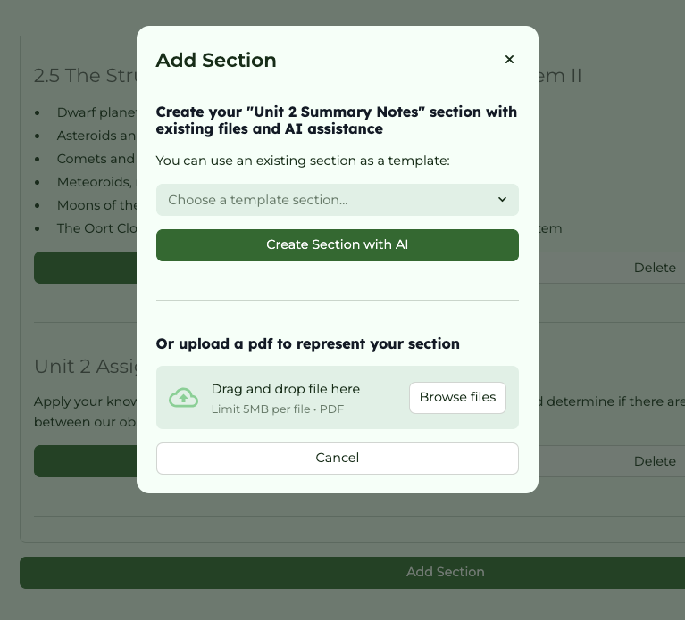
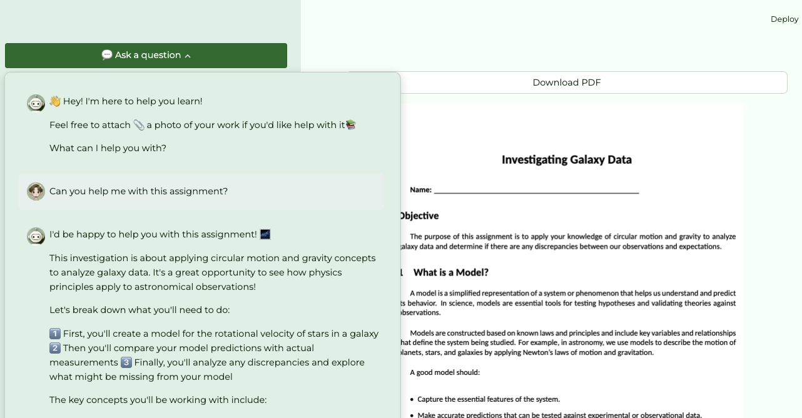

# Playlab Courses

A platform that allows educators to create AI-enhanced course websites with built-in intelligent assistants for both teachers and students.

## Live Access

- **Main Platform**: [playlab-courses.com](https://opencources.com)
- **Example Course**: [playlab-courses.com?astro-12](https://opencources.com?astro-12)

### Key Features

- **AI-Powered Course Creation**: AI helps teachers create and improve their course materials
- **Personalized Learning Support**: Build AI tutors that help students learn in ways that work best for them
- **Easy Organization**: Simple tools to arrange your course into units and sections
- **Export Your Work**: Save your course materials as Word docs, text files, or PDFs
- **Ready-to-Use Templates**: Save time by using existing content as starting points for new lessons
- **Homework Helper**: AI helps students when they get stuck on assignments
- **Share and Learn**: Join a community where teachers can share their courses with others

## 🤖 AI Assistants

### Teacher Assistant
- Makes creating course content easier and faster
- Gives tips to make your content better
- Helps format your documents neatly
- Check out the [Teacher Assistant built in Playlab](https://www.playlab.ai/project/cmaofa4o30m9fsvih246c1eqc)

### Student Assistant
- Easy to set up by teachers
- Make it work exactly how you want:
  - Put different helpers in different parts of your course
  - Instruct each helper to be an expert in specific topics
  - Give students the exact help they need
- Helps students right when they need it
- Answers questions about what students are reading
- Check out the [Student Assistant built in Playlab](https://www.playlab.ai/project/cmaofcbwm0m9lsvih8sdt1578)

## 📚 Building a Course

1. **Create a New Course**
   - Log in as a teacher
   - Enter course details:
     - Course name (e.g., "Introduction to Astronomy")
     - Course code
     - Grade level
     - Optional course description
   - Click "Create Course" to save

2. **Organize Course Content**
   - Add units to your course
   - For each unit:
     - Enter unit name and description
     - Add sections within the unit
   - Edit course details anytime:
     - Update course name, grade level, or description
     - Reorder units using drag and drop
     - Export course materials as docx/txt files

3. **Create Course Content**
   - For each section:
     - Add a title and overview
     - Use the built-in editor to create content OR upload a PDF, which will represent that section
     - Get AI assistance while writing
     - Preview your content in real-time

4. **Share Your Course**
   - Under the "Course Details" you can **make your course Open Source by making it "Open to All"**
   - Copy the course URL to share with students
   - Students can access the course using the URL
   - Export course materials for offline use

## 🔮 Future Developments

- **Enhanced RAG Capabilities**: Enable the AI to interact with the entire course material simultaneously
- **Advanced Document Editing**: Improve the AI-assisted document creation and editing